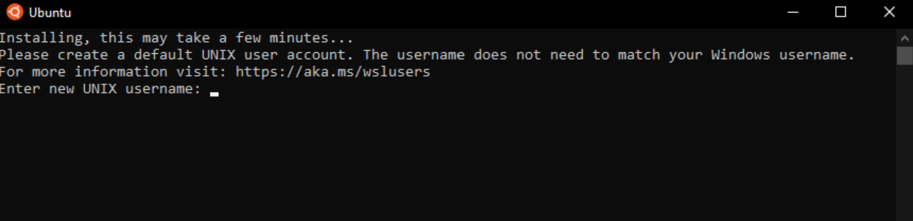
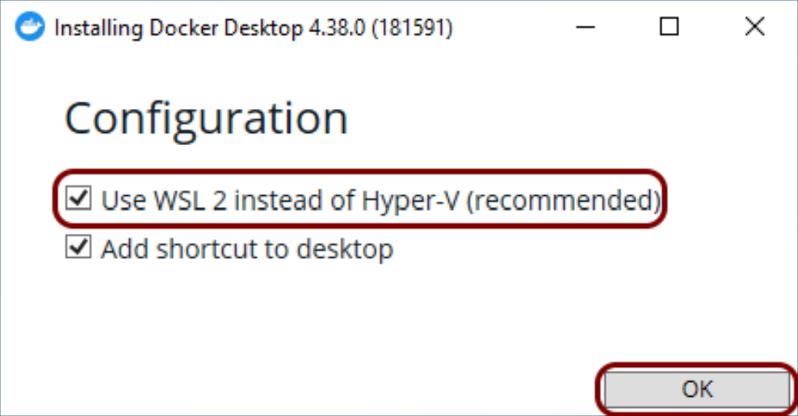
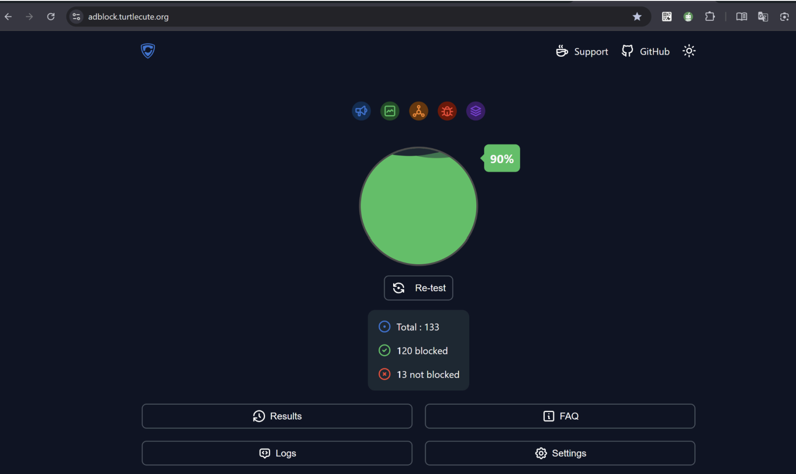
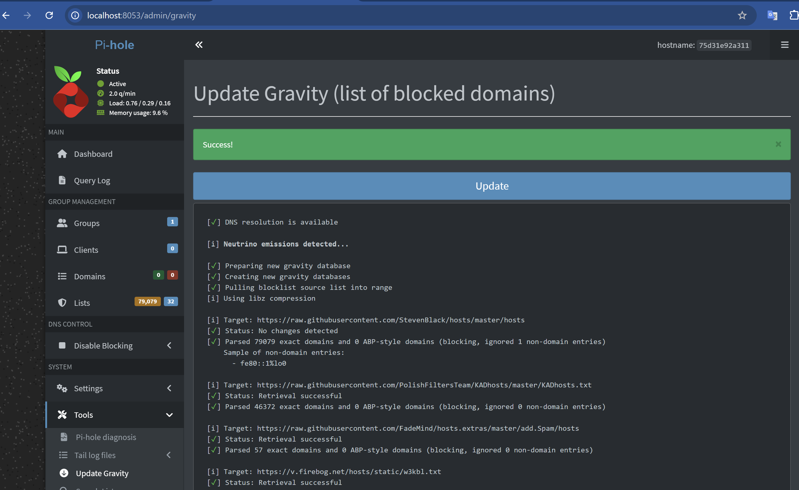

# Pi-hole + Unbound on Docker WSL2

Setting up Pi-hole with Unbound in Docker on WSL turns your Windows PC into a powerful ad-blocking and privacy hub for your entire network. You'll enjoy faster, cleaner browsing everywhere by blocking ads and trackers, while Unbound keeps your DNS queries private and speedy.

## 🚀 Very Quick Setup (Using Pre-configured Image)

If you want to skip manual configuration, you can use this pre-configured Unbound image.

1.  **Create a folder:** `mkdir C:\pihole-unbound && cd C:\pihole-unbound`
2.  **Create `docker-compose.yml`** with this content:

```yaml
services:
  pihole:
    container_name: pihole
    image: pihole/pihole:latest
    ports:
      - "53:53/tcp"
      - "53:53/udp"
      - "8053:80/tcp"
    environment:
      TZ: Asia/Bangkok
      WEBPASSWORD: SecurePass123!
      PIHOLE_DNS_: "127.0.0.1#5335"
    volumes:
      - ./etc-pihole:/etc/pihole
      - ./etc-dnsmasq.d:/etc/dnsmasq.d
    restart: unless-stopped
    cap_add:
      - NET_ADMIN

  unbound:
    container_name: unbound
    image: deedoi30/pihole-unbound:v1
    network_mode: "service:pihole"
    restart: unless-stopped
```

3.  **Run:** `docker compose up -d`

---

## Features

- **Ad blocking** via Pi-hole v6
- **Private recursive DNS** via Unbound (no third-party DNS servers)
- **DNSSEC validation** enabled and enforced
- Fully portable setup (works on any WiFi network)
- Self-contained Docker environment

## Requirements

- Windows 11
- WSL2 with Ubuntu
- Docker Desktop 4.38+

## Quick Start

Choose one of the two methods below to get started. **Method A** is recommended for most users as it's faster and less prone to configuration errors.

### Method A: Using Pre-configured Image (Recommended)

This method uses the pre-built image `deedoi30/pihole-unbound:v1` which already includes the optimized `unbound.conf` and `root.hints`.

1.  **Phase 1 & 2:** Complete WSL2 and Docker Desktop installation as described above.
2.  **Phase 3:** Free up Port 53 using the commands provided earlier.
3.  **Phase 4: Create Project Folder**
    ```cmd
    mkdir C:\pihole-unbound
    cd C:\pihole-unbound
    mkdir etc-pihole etc-dnsmasq.d
    ```
4.  **Phase 5: Create `docker-compose.yml`**
    Use the following content (no extra config files needed!):
    ```yaml
    services:
      pihole:
        container_name: pihole
        image: pihole/pihole:latest
        ports:
          - "53:53/tcp"
          - "53:53/udp"
          - "8053:80/tcp"
        environment:
          TZ: Asia/Bangkok
          WEBPASSWORD: SecurePass123!
          PIHOLE_DNS_: "127.0.0.1#5335"
        volumes:
          - ./etc-pihole:/etc/pihole
          - ./etc-dnsmasq.d:/etc/dnsmasq.d
        restart: unless-stopped
        cap_add:
          - NET_ADMIN

      unbound:
        container_name: unbound
        image: deedoi30/pihole-unbound:v1
        network_mode: "service:pihole"
        restart: unless-stopped
    ```
5.  **Phase 6: Start and Configure**
    Proceed to [Start the Stack](#phase-5-start-the-stack), [Enable DNSSEC](#phase-6-enable-dnssec-critical), and [Configure Pi-hole Web Admin](#phase-7-configure-pi-hole-web-admin).

---

### Method B: Manual Configuration

Use this method if you want to customize your Unbound configuration or use the official `mvance/unbound` image.

#### Phase 1: Install WSL & Ubuntu
Open CMD as Administrator:
```bash
wsl --install -d Ubuntu
```



Reboot when prompted. Ubuntu will launch automatically to set up your username and password.

#### Phase 2: Install Docker Desktop

1. Download from [docker.com](https://docker.com)
2. During installation ensure **"Use WSL 2 instead of Hyper-V"** is checked



3. After installation, log out and back in to Windows
4. Open Docker Desktop → Settings → Resources → WSL Integration → Enable **Ubuntu** → Apply & Restart


#### Phase 3: Free Up Port 53

Windows 11 reserves port 53 for Internet Connection Sharing. Disable it:
```cmd
netstat -ano | findstr ":53"
net stop SharedAccess
sc config SharedAccess start=disabled
```

⚠️ **Note:** This disables Windows Mobile Hotspot.

#### Phase 4: Create Project Files
```cmd
mkdir C:\pihole-unbound
cd C:\pihole-unbound
mkdir etc-pihole etc-dnsmasq.d
```

Download root hints:
```cmd
curl -o root.hints https://www.internic.net/domain/named.root
```

Create `docker-compose.yml` and `unbound.conf` (see [Files](#files) section below).

#### Phase 5: Start the Stack
```cmd
docker compose up -d
```

Wait 30 seconds, then verify:
```cmd
docker ps
docker logs unbound
```

Socket buffer warnings are normal and harmless in WSL2.

### Phase 6: Enable DNSSEC (Critical)

Pi-hole v6 requires CLI configuration:
```cmd
docker exec pihole pihole-FTL --config dns.dnssec true
docker exec pihole pihole-FTL --config dns.dnssec
docker restart pihole && docker restart unbound
```

⚠️ **Always restart in this order** — Unbound shares Pi-hole's network stack.

### Phase 7: Configure Pi-hole Web Admin

1. Open http://localhost:8053/admin
2. Go to Settings → DNS
3. Uncheck all upstream DNS servers
4. Check **Custom 1 (IPv4)** and enter: `127.0.0.1#5335`
5. Click Save

## Testing

### DNSSEC Validation (must use dig, not nslookup)
```cmd
docker exec pihole dig @127.0.0.1 -p 53 sigfail.verteiltesysteme.net +dnssec
```

✅ **Expected:** `status: SERVFAIL` — confirms DNSSEC is blocking bad signatures

### Normal DNS Resolution
```cmd
docker exec pihole dig @127.0.0.1 -p 53 pihole.net
```

✅ **Expected:** `status: NOERROR` — confirms normal resolution working

### Direct Unbound Test
```cmd
docker exec pihole dig @127.0.0.1 -p 5335 sigfail.verteiltesysteme.net
```

✅ **Expected:** `status: SERVFAIL` — confirms Unbound validates DNSSEC independently

**Why not nslookup?** Windows `nslookup` doesn't send DNSSEC-aware queries. Always use `dig +dnssec`.

## Files

### docker-compose.yml
```yaml
services:
  pihole:
    container_name: pihole
    image: pihole/pihole:latest
    ports:
      - "53:53/tcp"
      - "53:53/udp"
      - "8053:80/tcp"
    environment:
      TZ: Asia/Bangkok
      WEBPASSWORD: SecurePass123!
      DNS_FQDN_REQUIRED: "false"
      PIHOLE_DNS_: "127.0.0.1#5335"
    volumes:
      - ./etc-pihole:/etc/pihole
      - ./etc-dnsmasq.d:/etc/dnsmasq.d
    restart: unless-stopped
    cap_add:
      - NET_ADMIN

  unbound:
    container_name: unbound
    # Option A: Pre-configured Image (Recommended)
    image: deedoi30/pihole-unbound:v1
    
    # Option B: Manual Configuration
    # image: mvance/unbound:latest
    # volumes:
    #   - ./unbound.conf:/opt/unbound/etc/unbound/unbound.conf:ro
    #   - ./root.hints:/opt/unbound/etc/unbound/root.hints:ro

    network_mode: "service:pihole"
    restart: unless-stopped
```

### unbound.conf
```
server:
    verbosity: 0
    interface: 0.0.0.0
    port: 5335
    do-ip4: yes
    do-udp: yes
    do-tcp: yes
    do-ip6: no
    prefer-ip6: no

    root-hints: /opt/unbound/etc/unbound/root.hints
    auto-trust-anchor-file: /opt/unbound/etc/unbound/var/root.key

    harden-glue: yes
    harden-dnssec-stripped: yes
    harden-referral-path: yes
    harden-algo-downgrade: yes
    val-permissive-mode: no

    unwanted-reply-threshold: 10000
    val-clean-additional: yes
    edns-buffer-size: 1232
    prefetch: yes
    prefetch-key: yes
    num-threads: 2
    msg-cache-slabs: 2
    rrset-cache-slabs: 2
    infra-cache-slabs: 2
    key-cache-slabs: 2
    rrset-cache-size: 100m
    msg-cache-size: 50m
    so-rcvbuf: 1m
    so-sndbuf: 1m
    private-address: 192.168.0.0/16
    private-address: 169.254.0.0/16
    private-address: 172.16.0.0/12
    private-address: 10.0.0.0/8
    private-address: fd00::/8
    private-address: fe80::/10
    access-control: 127.0.0.0/8 allow
    access-control: ::1 allow
    do-not-query-localhost: no
```

## Final Folder Structure
```
C:\pihole-unbound\
  ├── docker-compose.yml
  ├── unbound.conf
  ├── root.hints
  ├── etc-pihole\          (auto-created)
  └── etc-dnsmasq.d\       (auto-created)
```

## Common Mistakes to Avoid

### 1. Wrong root.key path in unbound.conf

Must be `/opt/unbound/etc/unbound/var/root.key` — not `/opt/unbound/etc/unbound/root.key`. The wrong path causes Unbound to run without DNSSEC validation silently.

### 2. Downloading root-anchors.xml as root.key

The IANA root-anchors.xml is XML format and incompatible with Unbound. Never run:
```
curl https://data.iana.org/root-anchors/root-anchors.xml -o root.key
```

### 3. Using DNSSEC env var in Pi-hole v6

Pi-hole v6 ignores v5 environment variables. Use CLI instead:
```
docker exec pihole pihole-FTL --config dns.dnssec true
```

### 4. Restarting Pi-hole without restarting Unbound

Unbound shares Pi-hole's network stack. Always use:
```
docker restart pihole && docker restart unbound
```

### 5. Testing DNSSEC with nslookup

`nslookup` doesn't send DNSSEC-aware queries. Always test with:
```
docker exec pihole dig @127.0.0.1 -p 53 sigfail.verteiltesysteme.net +dnssec
```

### 6. Socket buffer warnings in Unbound logs

Warnings about `so-rcvbuf` and `so-sndbuf` are harmless in WSL2/Docker. They don't affect DNS functionality.

## Complete Removal
```cmd
cd C:\pihole-unbound
docker compose down -v
docker rmi pihole/pihole:latest mvance/unbound:latest deedoi30/pihole-unbound:v1
rmdir /s /q C:\pihole-unbound
```

## Tips & Resources

- **Extra blocklists:** [https://firebog.net/](https://firebog.net/)
- **Ad-block test:** [https://adblock.turtlecute.org](https://adblock.turtlecute.org)
- **Portability:** DNS stays at 127.0.0.1 regardless of WiFi network
- **View all Pi-hole v6 config:** `docker exec pihole pihole-FTL --config`





## License

MIT
